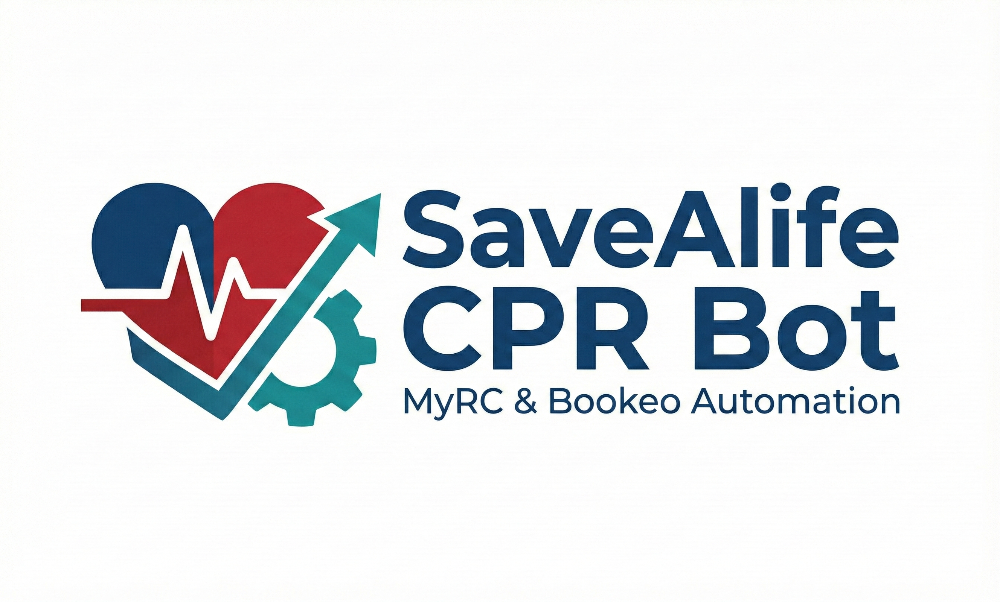

<p align="center">
  
</p>

# SaveALife CPR Bot

**Status: Production Ready (v2.0.0 - November 2025)**

Automated course registration bot that syncs Bookeo bookings to the Canadian Red Cross MyRC portal.

## Overview

This bot listens for Bookeo webhook events when customers book CPR/First Aid courses and automatically registers them in the Canadian Red Cross MyRC system. It handles:

- Azure AD B2C two-step authentication to MyRC portal
- Course lookup by date, type, and location (substring matching)
- Participant registration via OData REST API (new or existing contacts)
- Smart CPR level assignment based on course type
- Email notifications for registration status
- Bookeo booking updates with registration results
- Async Lambda invocation for fast webhook response

> **Background:** This is a complete rewrite of the original `lambda_function.py` which stopped working when Canadian Red Cross updated their MyRC portal in late 2025. Changes included:
> - Authentication flow changed from single-step to two-step B2C
> - Form-based ASP.NET endpoints deprecated in favor of OData REST APIs
> - New `data-view-layouts` attribute for SecureConfiguration extraction

## How It Works

```
┌─────────┐     Webhook      ┌─────────┐     B2C Auth     ┌─────────┐
│ Bookeo  │ ───────────────► │ CPR Bot │ ───────────────► │  MyRC   │
│ Booking │                  │         │ ◄─────────────── │ Portal  │
└─────────┘                  └─────────┘   Course Data    └─────────┘
     ▲                            │
     │      Update Booking        │
     └────────────────────────────┘
```

1. Customer books a course on Bookeo
2. Bookeo sends webhook to the bot
3. Bot authenticates with MyRC via Azure AD B2C (two-step flow)
4. Bot searches for matching course session
5. Bot registers participant(s) in MyRC
6. Bot updates Bookeo with registration status
7. Email notification sent with results

## Setup

### Prerequisites

- Python 3.10+
- [uv](https://github.com/astral-sh/uv) package manager (recommended) or pip

### Installation

```bash
# Clone the repository
git clone https://github.com/spragginsdesigns/savealife-cpr.git
cd savealife-cpr

# Install dependencies with uv
uv sync

# Or with pip
pip install -r requirements.txt
```

### Configuration

1. Copy the example environment file:
   ```bash
   cp .env.example .env
   ```

2. Edit `.env` with your credentials:
   ```env
   # Bookeo API Credentials
   BOOKEO_API_KEY=your_bookeo_api_key
   BOOKEO_SECRET_KEY=your_bookeo_secret_key

   # MyRC Portal Credentials
   MYRC_EMAIL=your_myrc_email@example.com
   MYRC_PASSWORD=your_myrc_password

   # Email Notifications (optional)
   EMAIL_USER=your_gmail@gmail.com
   EMAIL_PASSWORD=your_gmail_app_password
   EMAIL_RECIPIENTS=["recipient1@example.com", "recipient2@example.com"]
   ```

### Testing the Connection

Run the test script to verify your credentials work:

```bash
python test_login.py

# Full test including course search
python test_login.py --full
```

Expected output:
```
==================================================
LOGIN SUCCESSFUL!
==================================================
Secure config obtained: ...
```

## Usage

### As AWS Lambda

The bot is designed to run as an AWS Lambda function triggered by Bookeo webhooks:

```python
from cpr_bot import lambda_handler

# Lambda will call this with the Bookeo webhook event
def handler(event, context):
    return lambda_handler(event, context)
```

### Locally (for testing)

```python
from cpr_bot import CprBot

bot = CprBot()

# Test event structure
event = {
    "itemId": "BOOKING_ID",
    "item": {
        "bookingNumber": "12345",
        "productName": "Cambridge: Standard First Aid",
        "startTime": "2025-12-01T09:00:00",
        "options": [...],
        "participants": {
            "details": [...]
        }
    }
}

result = bot.run(event)
```

## Bookeo Webhook Setup

1. Go to Bookeo Settings > Integrations > Webhooks
2. Add a new webhook pointing to your Lambda endpoint
3. Select "New Booking" event type
4. Use your API key and secret key for authentication

## Course Type Mapping

The bot maps Bookeo course names to MyRC course types:

| Bookeo Course | MyRC Course Type |
|--------------|------------------|
| Standard First Aid | Standard First Aid Blended |
| Emergency First Aid | Emergency First Aid Blended |
| CPR/AED | CPR/AED Blended |
| Basic Life Support | Basic Life Support |
| Babysitter's Course | Babysitter Course |
| Stay Safe! | Stay Safe! |
| Recertification courses | (Recert) suffix |

## CPR Level Logic

The bot intelligently assigns CPR levels based on course type:

| Course Type | CPR Level Behavior |
|-------------|-------------------|
| Regular courses (SFA, EFA, CPR/AED) | Always Level C (upgrade) |
| Recertification courses | Keeps customer's selection (A or C) |
| Basic Life Support | Keeps customer's selection |
| Babysitter / Stay Safe! | No CPR level (not applicable) |

## Response Codes

The bot returns these status codes in Bookeo's externalRef field:

| Code | Meaning |
|------|---------|
| Success | Participant registered successfully |
| No Courses Found | No matching course for date/location/type |
| Multiple Courses Found | Ambiguous match - manual review needed |
| Failed to Create Contact | OData API contact creation failed |
| Failed to Add Participant | OData API participant creation failed |
| Login Failed | MyRC authentication failed |
| Malformed Data | Missing required participant info |

## Technical Details

### Authentication Flow

The bot uses Azure AD B2C with a two-step authentication:

1. GET sign-in page, extract CSRF token and StateProperties
2. POST email + password to SelfAsserted endpoint
3. GET confirmation page, extract new CSRF
4. POST password again (second step)
5. GET final confirmation with id_token
6. POST tokens to MyRC to complete sign-in

### SecureConfiguration

MyRC uses a PowerApps portal with encrypted grid configurations. The bot extracts `Base64SecureConfiguration` from the `data-view-layouts` attribute on the CourseManagement page, which is required for all API calls.

### MyRC OData API Reference

The portal uses Dynamics 365/PowerApps OData endpoints:

**Contact Search:**
```http
GET /_api/contacts?$filter=(lastname eq 'DOE' and emailaddress1 eq 'john@example.com' and statecode eq 0)
```

**Create Contact:**
```http
POST /_api/contacts
Content-Type: application/json

{
  "firstname": "John",
  "lastname": "Doe",
  "emailaddress1": "john@example.com",
  "address1_line1": "123 Main St",
  "address1_city": "Toronto",
  "address1_stateorprovince": "ON",
  "address1_postalcode": "M5V 1A1",
  "telephone1": "(416) 555-1234"
}
```

**Add Participant to Course Session:**
```http
POST /_api/crc_courseparticipants
Content-Type: application/json

{
  "crc_attendee@odata.bind": "/contacts(CONTACT_GUID)",
  "crc_coursesession@odata.bind": "/crc_coursesessions(SESSION_GUID)",
  "crc_participanttype": "0",
  "crc_status": "171120001"
}
```

### Lambda Async Pattern

The Lambda handler uses async invocation to respond quickly to Bookeo webhooks:

1. Webhook arrives at API Gateway → Lambda
2. Lambda immediately returns `200 OK` to Bookeo
3. Lambda invokes itself asynchronously with the event payload
4. Async invocation performs the actual registration work

This prevents Bookeo webhook timeouts while allowing the bot to take its time with authentication and registration.

```python
# In lambda_handler:
# 1. Parse API Gateway body
# 2. If not async call, invoke self with InvocationType='Event'
# 3. Return immediately to caller
# 4. Async call does the actual work via CprBot().run(event)
```

## Important: Course Sync Requirement

**Bookeo and MyRC are separate systems.** The bot can only register participants if the course session already exists in MyRC.

| System | Purpose |
|--------|---------|
| Bookeo | Customer booking/payment (where customers book) |
| MyRC | Red Cross certification portal (where participants get registered) |

**Workflow requirement:**
1. Create the course session in MyRC **first**
2. Then customers can book in Bookeo
3. Bot will automatically register them in MyRC

**If a customer books before the MyRC course exists:**
- The webhook will fire and return "No Courses Found"
- The bot does NOT automatically retry when the course is created later
- **Manual action required:** Either re-trigger the webhook from Bookeo or manually register the participant in MyRC

## Troubleshooting

### Login Failed
- Verify MyRC credentials in `.env`
- Check if MyRC portal is accessible
- The B2C policy may have changed (current: `B2C_1A_MYRC_SIGNUP_SIGNIN`)

### No Courses Found
- **Most common cause:** The course exists in Bookeo but hasn't been created in MyRC yet
- Verify course date format (YYYY-MM-DD)
- Course type and location use **substring matching** (e.g., "Cambridge" matches "Cambridge Training Center")
- Check debug logs for actual course types/locations returned by MyRC

### API Errors
- SecureConfiguration may have expired (re-login)
- Verification token may be stale (refresh)

## Changelog

### v2.0.0 (November 2025)
- Complete rewrite for updated MyRC portal
- Two-step Azure AD B2C authentication flow
- OData REST API for contacts and participants (replaces deprecated form endpoints)
- Smart CPR level logic (upgrade regular courses, preserve recert selections)
- Babysitter Course and Stay Safe! course support
- Substring matching for course type and location lookups
- Async Lambda invocation pattern for webhook responsiveness
- API Gateway body parsing support

### v1.0.0 (Original)
- `lambda_function.py` - Single-step B2C auth with form-based endpoints (deprecated)

## License

Private - SaveALife CPR Training

## Support

For issues, contact tyler@savealifecpr.ca
